# Tutorials for deployment

Depending on the needs regarding the deployment of the Context Broker Data Visualisation enabler, there are four different tutorials.

They are also divided between **local environment** and **FIWARE lab (or Sandbox)**.

## Content

- [Local environment](#local-environment)
  - [Tutorial 1: Enabler](#firstTutorial)
  - [Tutorial 2: Enabler + Context Broker](#secondtutorial)
  - [Tutorial 3: Enabler + Context Broker + Cygnus + STH-Comet](#thirdTutorial)
    - [Generating test data](#thirdTutorial-generating-test-data)
  - [Connection between the Enabler and FIWARE tools](#connection-between-the-enabler-and-fiware-tools)
- [FIWARE lab](#fiware-lab)
  - [Tutorial 4: FIWARE lab](#fourthTutorial)
    - [Configuring the IP](#fourthTutorial-configuration)
    - [Deploying the enabler](#fourthTutorial-deploy)
    - [Associate Floating IP](#fourthTutorial-ip)
    - [Deploying the enabler tools](#fourthTutorial-tools)
      - [Generating test data on the enabler tools](#fourthTutorial-generating-test-data)

## Local environment

The first three tutorials are focused on a deployment in a local environment.

Depending on the **needs of the tools** to be deployed, it should be better to select the most adequate tutorial.

They are ordered by the number of tools that are deployed, being the third tutorial the most complete.

As a pre-requisite, [Docker](https://www.docker.com/) **needs to have been installed** before starting with any of the **tutorials in a local environment**.

[Top](#tutorials-for-deployment)

<a name="firstTutorial"></a>

### Tutorial 1: Enabler

This option is recommended for those users who want to deploy the enabler in a local environment and **already have a Context Broker instance** or want to use an **external Context Broker instance (possibly, already running in a server)**. In this case, the user would only need to deploy the enabler.

The steps for the deployment are the following:

1. Check Docker is running on the computer.

2. Open a terminal and go to the folder: **workspace/tutorials/enabler**

    ```bash
    cd workspace/tutorials/enabler
    ```

3. In case of **Windows** run the script called **deploy_windows.bat**:

    ```bash
    deploy_windows.bat
    ```

    In case of **Linux** run the script called **deploy_linux.sh**

    ```bash
    sh deploy_linux.sh
    ```

4. Now, the needed images are being downloaded from DockerHub and they will be started after the download.

5. Execute the following command in the terminal:

    ```bash
    docker ps
    ```

6. There should be **two new containers in Docker**:

    - cbenabler
    - cbenabler-server

        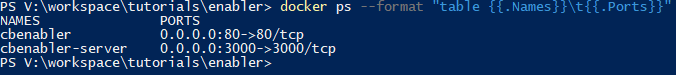
        >*Illustration 1. Docker images of Tutorial 1*

7. Go to the web browser and try to access the enabler using the following URL:

    ```url
    localhost
    ```

    If the deployment was done succesfully, you should see the enabler.

[Top](#tutorials-for-deployment)

<a name="secondTutorial"></a>

### Tutorial 2: Enabler + Context Broker

This second option is recommended for those users who want to deploy the enabler in a local environment, but **do not have any Context Broker instance for testing**. they are **interested in real-time data** and need a Context Broker instance, but are **not interested in historical data**.

The steps for the deployment are the following:

1. Check Docker is running on the computer.

2. Open a terminal and go to the folder: **workspace/tutorials/enabler_orion**

    ```bash
    cd workspace/tutorials/enabler_orion
    ```

3. In case of **Windows** run the script called **deploy_windows.bat**:

    ```bash
    deploy_windows.bat
    ```

    In case of **Linux** run the script called **deploy_linux.sh**

    ```bash
    sh deploy_linux.sh
    ```

4. Now, the needed images are being downloaded from DockerHub and they will be started after the download.

5. Execute the following command in the terminal:

    ```bash
    docker ps
    ```

6. There should be **four new containers in Docker**:

    - cbenabler
    - cbenabler-server
    - fiware-orion
    - db-mongo

    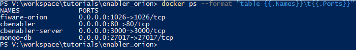
    >*Illustration 2. Docker images of Tutorial 2*

7. Go to the web browser and try to access to the enabler in the following URL:

    ```url
    localhost
    ```

8. If the deployment was done successfully, the Context Broker must be able to be connected in the Configuration page:

    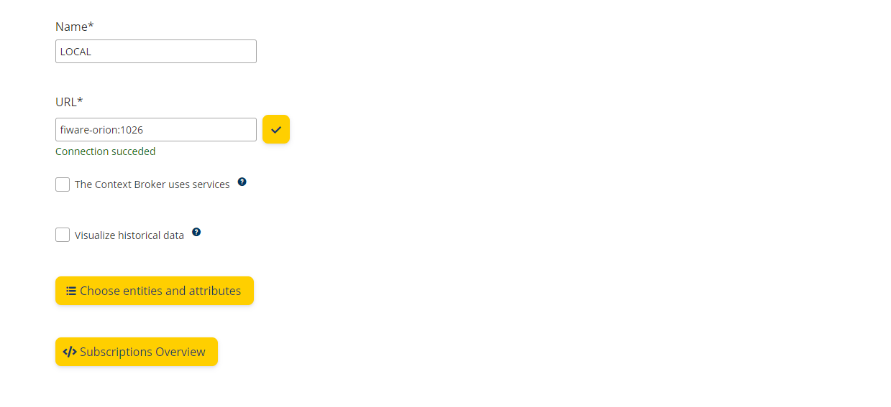
    *Illustration 3. Configuration of the Tutorial 2*

[Top](#tutorials-for-deployment)

<a name="thirdTutorial"></a>

### Tutorial 3: Enabler + Context Broker + Cygnus + STH-Comet

This third option is recommended for those users who want to deploy the enabler in a local environment and are **interested in both real-time data (Context Broker) and historical data (Cygnus and STH-Comet)**.

This options is the most complete tutorial for local environments. It will guide the user in how to **deploy the complete architecture of the enabler**:

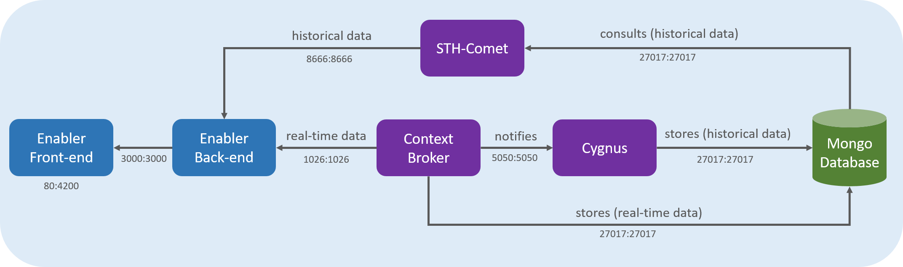
>*Illustration 4. Architecture of the enabler*

More information related with the architecture can be found [here](../technical/index.md/#architecture).

The steps for the deployment are the following:

1. Check Docker is running on the computer.

2. Open a terminal and go to the folder: **workspace/tutorials/enabler_orion_cygnus_sth**

    ```bash
    cd workspace/tutorials/enabler_orion_cygnus_sth
    ```

3. In case of **Windows** run the script called **deploy_windows.bat**:

    ```bash
    deploy_windows.bat
    ```

    In case of **Linux** run the script called **deploy_linux.sh**

    ```bash
    sh deploy_linux.sh
    ```

4. Now, the needed images are being downloaded from DockerHub and they will be started after the download.

5. Execute the following command in the terminal:

    ```bash
    docker ps
    ```

6. There should be **six new containers in Docker**:

    - cbenabler
    - cbenabler-server
    - fiware-orion
    - fiware-cygnus
    - fiware-sth-comet
    - db-mongo

    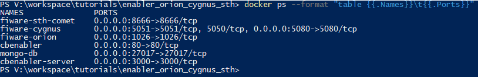
    >*Illustration 5. Docker images of Tutorial 3*

7. Go to the web browser and try to access to the enabler in the following URL:

    ```url
    localhost
    ```

8. If the deployment was done successfully, the Context Broker, Cygnus and STH-Comet must be able to be connected in the Configuration page:

    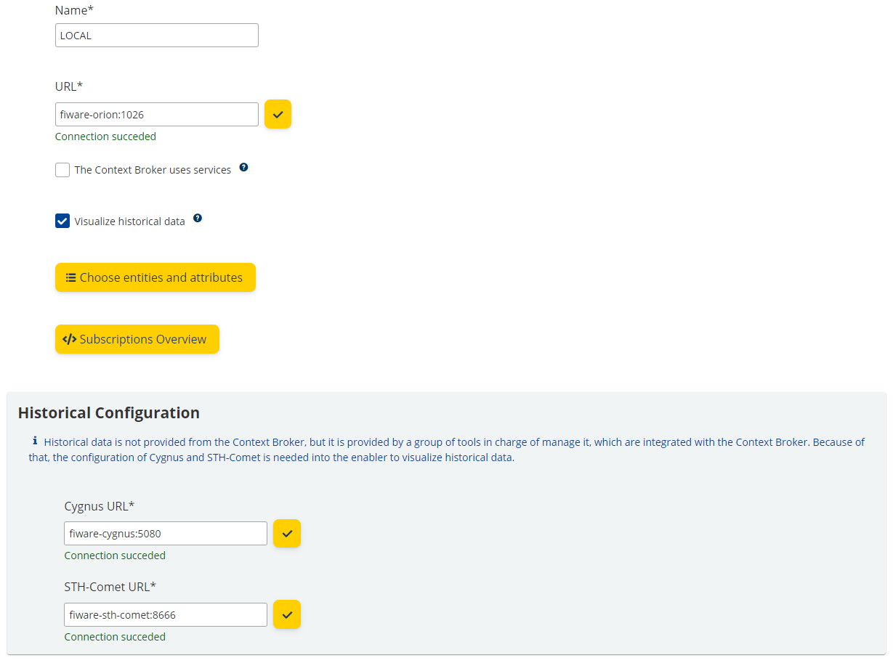
    *Illustration 6. Configuration of the Tutorial 3*

[Top](#tutorials-for-deployment)

<a name="thirdTutorial-generating-test-data"></a>

#### Generating test data

It is possible to generate test data to fill the Context Broker. For this, it will be necessary to download the script that is in [this link](https://raw.githubusercontent.com/ConnectingEurope/Context-Broker-Data-Visualisation/develop/tutorials/enabler_orion_cygnus_sth/test-data/create-data.py) of the GitHub repository, and it will need to be executed using [python3](https://www.python.org/downloads/).

- To create the test data, the following python command must be executed using the **create-data.py** file:

    ```bash
    python3 create-data.py
    ```

- By default, **two new test registries** will be inserted in the Context Broker **every hour**. The available services to retreive the information from the Context Broker are:
  - testparking
  - testenvironment

As a result, the execution of the Python script will generate test data into the Context Broker, and it will be available in the enabler.

### Connection between the Enabler and FIWARE tools

Tutorials 2 (Enabler + Context Broker) and 3 (complete architecture) generate new Docker images in a local environment. The **access URLs for the tools** are:

- fiware-orion:1026
- fiware-cygnus:5080
- fiware-sth-comet:8666

However, if the tools have been deployed separately (using other FIWARE tutorials), the following URLs should be used instead:

- localhost:1026
- localhost:5080
- localhost:8666

[Top](#tutorials-for-deployment)

## FIWARE lab

This tutorial is focused on the deployment of the enabler in the **FIWARE lab** (or Sandbox).

As a pre-requisite, a FIWARE lab account is needed in order to follow this tutorial. In order to register, access to [this link](https://cloud.lab.fiware.org/auth/login/) and click on the **Request Community Account** button.

After the registration, the deployment can be carried out following [Tutorial 4](#tutorial-4:-fiware-lab).

[Top](#tutorials-for-deployment)

<a name="fourthTutorial"></a>

### Tutorial 4: FIWARE lab

The deployment of the enabler in the FIWARE lab (or Sandbox) needs to set-up different configurations to achieve a succesful behaviour of the enabler and the rest of the tools. Those configurations are detailed as follows.

<a name="fourthTutorial-configuration"></a>

#### Configuring the IP

First of all, it is necessary to configure the **Access & Security** tab to enable access to the desired instances.

The steps to complete this are:

1. Go to the first tab of the Access & Security menu called **Security groups** and define a new security groups:
    - Click on **Create security Group** and define the name and description of the security group.
        - **Name:** cbenabler_security_group
        - **Description:** Context Broker Data Visualisation Enabler Security Group

    - Once the security group has been created, click on the button **Manage rules**, in order to enable the needed ports to establish communication with the enabler:
        - Add a **new rule** with the following data:
            - **Rule:** Custom TCP Rule
            - **Direction:** Ingress
            - **Open Port:** Port
            - **Port:** 80
            - **Remote:** CIDR
            - **CIDR:** 0.0.0.0/0

            The result should be the following:

            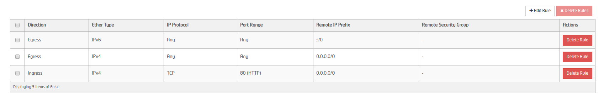
            >*Illustration 2. Rules of the security group*

2. Return to the Access & Security menu and change to the tab called **Floating IPs**.

    - Click on the button **Allocate IP To Project** and select the following data:
        - **Pool:** public-ext-net-01

        Once the new IP has been associated, the application will be accessible from that IP.

        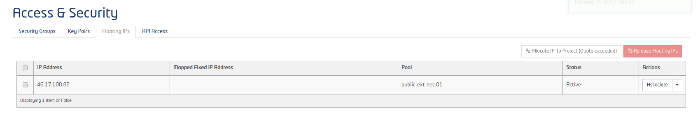
        >*Illustration 3. Associating a new IP address*

[Top](#tutorials-for-deployment)

<a name="fourthTutorial-deploy"></a>

#### Deploying the enabler

Once the configuration of the previous section has been completed and the new IP is available, the following step is to **deploy the enabler**.

For this purpose, there is a **public Sandbox image** that contains everything needed to deploy the enabler application.

An instance of the needed image can be created from the **Images** menu:

1. Look for the image called **cb_data_visualisation_enabler** in the public section.

2. Select the image an click on the **Launch Instance** button.

3. Fill in the following information:
    - Details:
        - **Availability Zone:** assign a zone to the instance.
        - **Instance name:** assign a name to the instance.
        - **Flavor:** At least one *medium-type image will be required*, but it is possible to assign large or short-large types.
        - **Instance Count:** Number of instances to be deployed, normally 1.
        - **Instance Boot Source:** Select the option *Boot from image*.
        - **Image Name:** Select the option *cb_data_visualisation_enabler_dev*.

    - Access & Security:
        - Select the security group **cbenabler_security_group** (created in the previous section).
    - Networking:
        - The **node-int-net-01** network should be in the **selected networks** section.

4. Launch the instance. It must be visible with *spawning* status in the **Instances** menu.

5. Once the instance is running (after waiting some minutes), it will take about 5 more minutes to automatically download the latest available version of the **Context Broker Data Visualisation Enabler** from DockerHub and deploy it.

[Top](#tutorials-for-deployment)

<a name="fourthTutorial-ip"></a>

#### Associate a Floating IP

At this point, the **Context Broker Data Visualisation Enabler** is deployed, but it is not accessible from the browser because it doesn't have an associated Floating IP (public IP) yet.

1. Go to the **Instances** menu and move the drop-down (bottom scroll bar) to the right.

2. Search the launched instance with running status, select it and click on **Associate Floating IP**.

    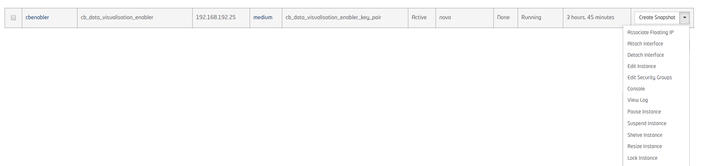
    >*illustration 4. Associate floating IP to the image*

3. Associate the IP created in the [Configuring the enabler](#fourthTutorial-configuration) section.

4. After this configuration, the **enabler is ready to be used by accessing the floating IP** in a web browser.

[Top](#tutorials-for-deployment)

<a name="fourthTutorial-tools"></a>

#### Deploying the enabler-tools

After completing the previous sections for the deployment of the enabler in the FIWARE lab, the tool will be available for use. However, the Enabler needs to be integrated with different tools to consume data. **As an optional configuration**, there is available a **second public image in the FIWARE lab, which contains the Enabler's optional set of tools**.

This image is available in the **Images** menu, and its name is **cb_data_visualisation_enabler_tools**. Concretely, it contains:

- **Orion Context Broker:** exposed in port 1026
- **Cygnus:** exposed in port 5080
- **STH Commet:** exposed in port 8666
- **MongoDB:** it is not exposed in any port, Internally uses port 27017.

In order to instantiate the image, a **new security group** must be configured in the **Access & Security** menu:

1. Click on **Create security Group** and define the name and description of the security group:

    - **Name:** cbenabler_tools_security_group
    - **Description:** Context Broker Data Visualisation Enabler Tools Security Group

    - Once the security group has been created, click on the button **Manage rules** in order to enable the needed ports to establish communication. Add the following rules:
        - Add rule:
            - **Rule:** Custom TCP Rule
            - **Direction:** Ingress
            - **Open Port:** Port
            - **Port:** 1026
            - **Remote:** CIDR
            - **CIDR:** 0.0.0.0/0

        - Add rule:
            - **Rule:** Custom TCP Rule
            - **Direction:** Ingress
            - **Open Port:** Port
            - **Port:** 5051
            - **Remote:** CIDR
            - **CIDR:** 0.0.0.0/0

        - Add rule:
            - **Rule:** Custom TCP Rule
            - **Direction:** Ingress
            - **Open Port:** Port
            - **Port:** 5080
            - **Remote:** CIDR
            - **CIDR:** 0.0.0.0/0

        - Add rule:
            - **Rule:** Custom TCP Rule
            - **Direction:** Ingress
            - **Open Port:** Port
            - **Port:** 8666
            - **Remote:** CIDR
            - **CIDR:** 0.0.0.0/0

2. At this point, the image must be launched in the **Images** menu.

3. Look for the image **cb_data_visualisation_enabler_tools** in the public section.

4. Select the image and click on the **Launch Instance** button.

5. Fill in the following information:
    - Details:
        - **Availability Zone:** assigns a zone to the instance.
        - **Instance name:** assigns a name to the instance.
        - **Flavor:** At least one medium-type image will be required, but it is possible to assign large or short-large types.
        - **Instance Count:** Number of instances to be deployed, normally 1.
        - **Instance Boot Source:** Select the option *Boot from image*.
        - **Image Name:** Select the option *cb_data_visualisation_enabler_tools*.
    - Access & Security:
        - Select the security group *cbenabler_tools_security_group*.
    - Networking:
        - The *node-int-net-01* network should be in the **Selected networks** section.
    - Post-creation:
        - Normally, this section should be empty if the purpose is that there is no information in the context borker. But the development team has prepared a python script in case the user wants to fill the context broker with test data. The documentation can be found at the following link: [generating test data](#fourthTutorial-generating-test-data)

6. The launched instance will be visible with *spawning* status in the **Instances** menu.

7. Once the instance is running (after waiting some minutes), it will take about 5 more minutes to download the latest available version of the tools from DockerHub and deploy them.

8. In this case, it will not be necessary to assign a Floating IP, since the instances have an internal IP that allows communication between them.

    Example:
    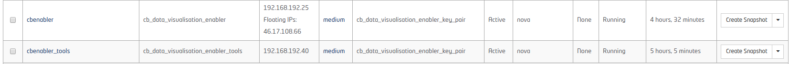
    >*Illustration 5. Enabler tools' internal IP*

9. After completing the previous steps, the communication between the enabler and the tools is achieved:

    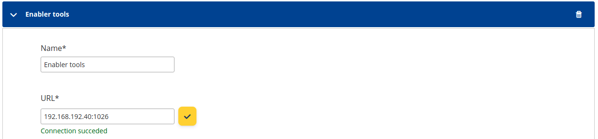
    >*Illustration 6. Communication between the enabler and the tools*

[Top](#tutorials-for-deployment)

<a name="fourthTutorial-generating-test-data"></a>

##### Generating test data on the enabler tools

The following section will detail how to generate test data for the enabler tools.

It is possible to launch scripts together with one instance in the FIWARE lab during the launch process. Concretely, in the **post-creation tab**.

A [Python3](https://www.python.org/downloads/) script has been created with the objective of filling the Context Broker and the historical data tools with **test data**, which is fake data.

First of all, it is necessary to download the script. It is available on the GitHub repository of the project, and also on this [link](https://raw.githubusercontent.com/ConnectingEurope/Context-Broker-Data-Visualisation/develop/tutorials/enabler_orion_cygnus_sth/test-data/create-data.py).

After that, the following steps need to be followed:

1. Configure the instance for the Enabler tools, as explaned [here](#fourthTutorial-tools).

2. In the **post-creation** tab, there are two options to execute the script:
    - The first option:
        - Customization Script Source:
            - Select *Direct Input*.
        - Script data:
            - Copy the content of the Python script.
    - The second option:
        - Customization Script Source:
            - Select *file*.
        - Script File
            - Upload the file of the Python script.

    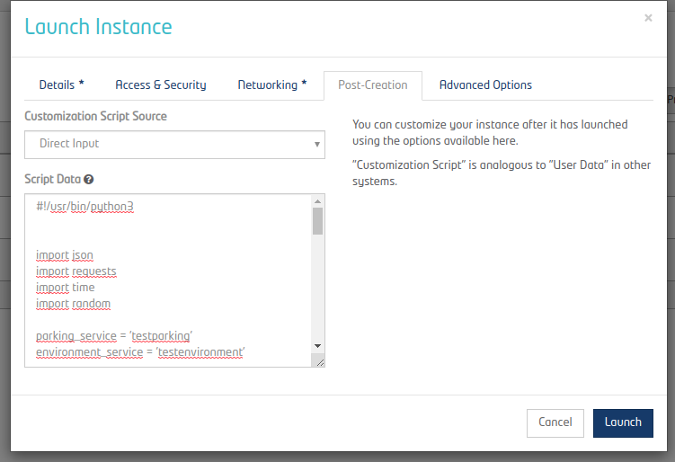
    >*Illustration 7. Generating test data*

3. The previous configuration will execute the Python script together with the instance of the Enabler tools.

The Context Broker will receive **two new test registries** from the script **every hour**.

The **services to be used** for this testing data are:

- testparking
- testenvironment

[Top](#tutorials-for-deployment)
