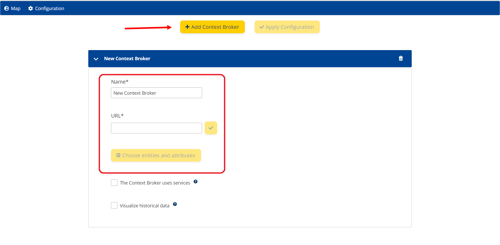
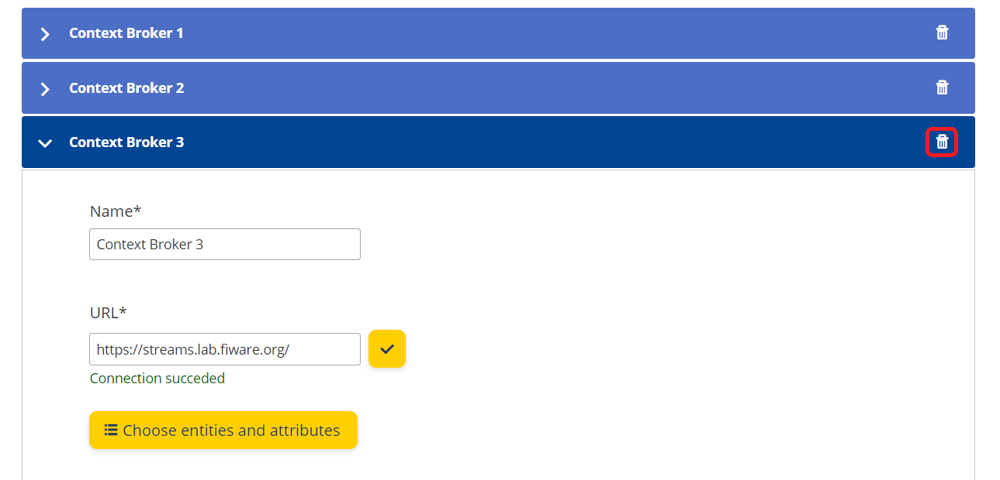
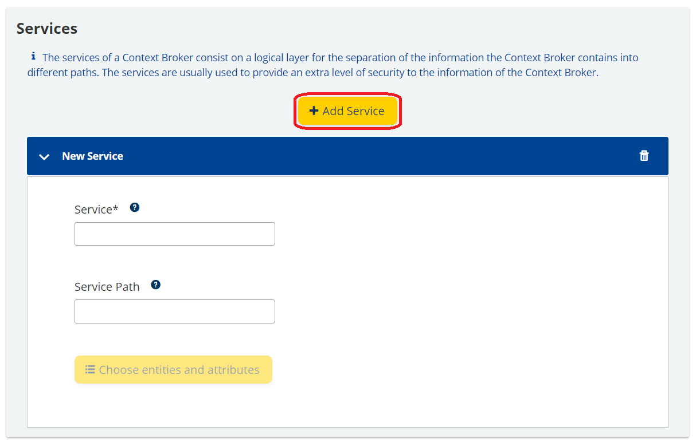
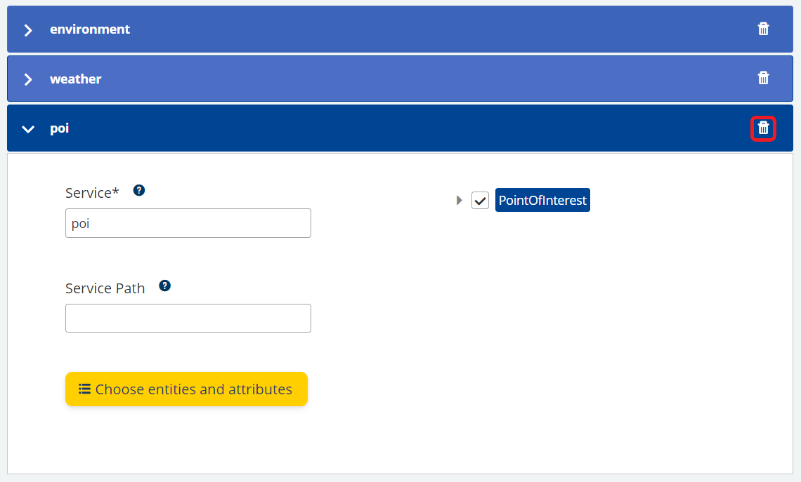
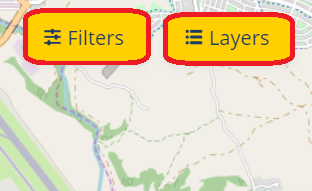
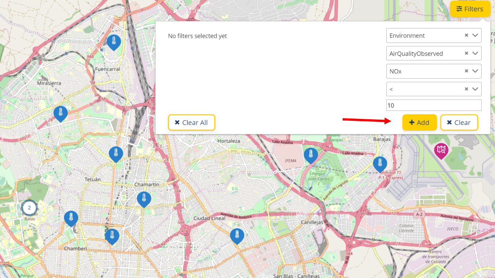

# User manual

The aim of this document is to create a functional guide to ensure the understanding of the enabler, so the users are able to exploit it to its fullest.

The Context Broker Data Visualization enabler has been created to ease the understanding of data and use of the Context Broker and to fasten its learning curve for new stakeholders who would like to experiment. It consists in a visualization layer over the Sandbox environment of the Context Broker used for playground purposes.

The enabler is available for use in local or remote environments. There is also available a [deployment manual](../tutorials/index.md) to ease its implementation and deployment.

On the other hand, the enabler gives the opportunity to play with a sensor’s historical data, if configured. Having selected a range of time, it can be represented in a table or even downloaded in a CSV file to further exploit. Furthermore, one of the attributes at a time can be selected and represented in a graph.

## Contents

- [How to start](#how-to-start)
  - [How to access the  Enabler](#how-to-access-the-enabler)
  - [Initial configuration assistant](#initial-configuration-assistant)
- [Configuration](#configuration)
  - [Configuring Context Broker](#configuring-context-broker)
    - [Services](#services)
    - [Configuring main attributes](#configuring-main-attributes)
  - [Historical data tools](#historical-data-tools)
    - [Cygnus](#cygnus)
    - [STH-Comet](#sth-comet)
    - [Tool configuration](#tool-configuration)
  - [Saving configuration](#saving-configuration)
- [Dashboard](#dashboard)
  - [Map](#map)
    - [Main attributes](#main-attributes)
  - [Sensors](#sensors)
  - [Search Bar](#search-bar)
  - [Managing the sensors](#managing-the-sensors)
    - [Layers](#layers)
    - [Filters](#filters)
- [Historical data](#historical-data)
  - [Tables](#tables)
    - [Filters of the table](#filters-of-the-table)
    - [Information of the table](#information-of-the-table)
  - [Graphs](#graphs)
    - [Filters of the graph](#filters-of-the-graph)
    - [Information of the graph](#information-of-the-graph)
  - [CSV Data Export](#csv-data-export)

## How to start

This section describes how to start using the Context Broker Data Visualization enabler, once it has been deployed.

[Top](#user-manual)

### How to access the Enabler

Once the Enabler has been deployed either on local, remote server or Sandbox, the user is able to access via web browser, as this Enabler is a web application.

In order to access the user should introduce in the web browser’s search bar the URL where the Enabler has been deployed, i.e. localhost:4200 is set by default.

>*Illustration 1. Web browser’s search bar.*

[Top](#user-manual)

### Initial configuration assistant

Once the user access for the first time to the Enabler, there is no information to be displayed. It is necessary to configure one instance of a Context Broker at least. Hence, a pop-up will appear giving the option to the user to be redirected to the Configuration page and start configuring a new instance.

> *Illustration 2. Initial configuration pop-up*

[Top](#user-manual)

## Configuration

With the purpose of facilitating the integration of one or various Context Brokers and historical data tools, the Enabler provides a configuration panel that is visual and intuitive. The user can use this panel to configure the information that is desired to be visualized.

This configuration is divided into three sections: how to configure and edit a Context Broker, how to add services, if any, and how to configure the historical data tools if necessary.

[Top](#user-manual)

### Configuring Context Broker

The “Add Context Broker” button at the top part of the illustration 3, should be clicked to a new configuration tab for a Context Broker. For the first access, the tab for the configuration of a new instance is automatically opened.

When an empty tab is open, the user should introduce the desired name for that particular Context Broker and the URL where the data is available. Note that there may be the need to indicate the Context Broker’s port if the instance is serving in a determined one. For example, if it is configured in local and the port number is 1026, the URL should be localhost:1026.

When that configuration is settled, the user should check the status of that Context Broker and ensure that the configuration provided is valid and ready to go, this can be done by clicking the yellow checkbox next to the URL.

>*Illustration 3. Configuration Panel*

>*Illustration 4. Adding a new Context Broker*

If the URL introduced for the Context Broker is incorrect, a message under the URL box will appear informing of the unsuccessful connection.

>*Illustration 5. Incorrect Context Broker URL.*

After the initial configuration of the Context Broker is cleared, the user should choose the desired entities and attributes from it by clicking the bottom option shown in the illustration 6.

>*Illustration 6. Successful Context Broker connection.*

>*Illustration 7. Selecting the entities and attributes.*

The entities and attributes can be selected and unselected by clicking on the checkbox or the name of the desired option. If no entities are selected in the Context Broker an error message will appear, as shown in illustration 15.

If various Context Brokers are added, they will appear as a list where each one can be displayed for its edition. If the user desires to delete a Context Broker the icon at the right part of the name should be clicked. A message will appear asking to confirm the action, this should be done by clicking the delete option in illustration 8.

>*Illustration 8. Context Broker List.*

>*Illustration 9. Deleting a Context Broker.*

[Top](#user-manual)

#### Services

The information of a Context Broker can be organized and divided in what is called “Services”. With this, the information can be encapsulated in different groups and access to them has to be granted. The aim of this tool, that is optional, is to increase the security of the CB data, by dividing it in groups and only grant access to specific users. A user may have access to one service but not to the rest. Therefore, the user has the option of adding a service if necessary. If more information is needed, it can be found [here](https://fiware-orion.readthedocs.io/en/master/user/service_path/index.html).

If the user has access to one or several services, they can be added, edited and eliminated. In order to add a new service to a Context Broker, the checkbox marked in the illustration 10 should be clicked. A new box with the Services configuration will be opened where the user can start configuring them.

>*Illustration 10. Configuring services.*

The user should click the “Add Service” option, shown at the top of the illustration 11, so as to add as many Services as needed.

>*Illustration 11. Adding services.*

The user will need to configure the name of the service and, if desired, the service path. To check its availability, the “choose entities and attributes” button should be clicked. If this configuration is incorrect a message indicating so will appear informing that there are no entities for it.

>*Illustration 12. Incorrect service name.*

>*Illustration 13. Incorrect service path.*

If the configuration is correct, a list of the available entities and attributes will appear, where the user can select or unselect the desired ones. However, at least one entity has to be selected, if not an error message, shown in illustration 15, will appear.

>*Illustration 14. Correct service name and path.*

>*Illustration 15. Error message for no entities selected.*

A list of the introduced services will appear where the user can edit by clicking the service name or deleted by clicking the icon in the right part of the illustration. A confirmation message will appear where the user should click the delete option to finish the action.

>*Illustration 16. List of services.*

>*Illustration 17. Deleting a Service.*

[Top](#user-manual)

#### Configuring main attributes

Once the entities and the attributes of the Context Broker (or one of its services) has been loaded, there are also **star icons** on the right of each attribute.

This star allow the user to select the **main attribute of the entity**, for a special visualization on the map.

It is only allowed to select one main attribute per each category.

>*Illustration 18. Configuring main attributes*

[Top](#user-manual)

### Historical data tools

In order to complement the real-time data, the Enabler offers the possibility to combine it with historical data. Hence, the user is able to optionally configure tools for its implementation in the Configuration page.

The historical data in the Enabler supports two tools that must be configured for each of the Context Brokers as they work together, if any of the tools is not available, the visualization of the historical data will not be possible. The supported tools for the historical data are Cygnus and STH-Comet.

[Top](#user-manual)

#### Cygnus

The first of this two tools is Cygnus. It acts as a connector between the Context Broker’s information that the sensors produce and the MongoDB database that will storage that information. Basically, Cygnus is subscribed to the information the CB produces and creates the historical data for the database. More information can be found at this [link](https://fiware-cygnus.readthedocs.io/en/latest/).

[Top](#user-manual)

#### STH-Comet

The second tool is STH-Comet. In essence, this tool retrieves the historical data created by Cygnus from the database and allows the user to consult and work with it. If needed, the user can find more information [here](https://fiware-sth-comet.readthedocs.io/en/latest/).

[Top](#user-manual)

#### Tool configuration

In conclusion, if the user wants to use the historical data, Cygnus and STH-Comet must be configured for each of the Context Brokers. The user should introduce the desired URL and the chosen port for each of the tools and check the availability for them. If any of the tools is not available, the configuration and exportation of the historical data will not be possible.

If the introduced URL is not correct, an error message informing of the unsuccessful connection will appear.

>*Illustration 18. Cygnus and STH-Comet tools.*

>*Illustration 19. Incorrect Cygnus or STH-Comet URL.*

[Top](#user-manual)

### Saving configuration

Once the user has finished configuring the Context Broker, its services and tools, the “Apply Configuration” at the top part of the page should be clicked so as to save it. If not, the current configuration will be lost and the deleted options will continue to appear.

>*Illustration 20. Saving the configuration.*

[Top](#user-manual)

## Dashboard

### Map

The map that supports the Enabler is the open source World map [OpenStreetMaps](https://www.openstreetmap.org/).

The Enabler supports the use of various CB, therefore, all of the information contained in the configured Context Brokers is shown in the map with the real-time information which they provide.

Regarding the representation of the sensors, all of them have coordinates for their geo-location and, taking profit of those coordinates, they can be displayed directly over the map.

When zooming out in the map, the icons will start to cluster together in a single notification, showing the number of sensors available in the area. As the user zooms in, the sensors will start to separate and appear in the exact spot, the cluster with the number will disappear.

>*Illustration 21. The Enabler Map.*

[Top](#user-manual)

#### Main attributes

If at least one important attribute for the different types of sensors has been configured in the Configuration page, the visualization of the map will include the visualization of **Main attributes**.

>*Illustration 22. Main attributes over the sensors*

There is also a **caption** on the bottom left of the map, which indicates the attributes that are displayed for each type of sensor.

The switch option on the top right of the map, allow the user to show or hide the main attributes over the sensors.

>*Illustration 23. Main attributes disabled*

[Top](#user-manual)

### Sensors

The icons that appear in the map respond to a list of categories that classifies the data in different groups depending on the type of information it gives:

**Alerts**: Alerts Events related to risk or warning conditions which require action taking.

**Smart Environment**: Domain repository for topics related with environment. Currently available Environment, Waster management and Weather.

**Environment**: Enable to monitor air quality and other environmental conditions for a healthier living.

**Point of interest**: Specific point locations that someone may find useful or interesting. For instance, weather stations, touristic landmarks, etc.

**Civic issue tracking**: Data models for civic issue tracking interoperable with the de-facto standard Open311.

**Street lighting**: Modeling street lights and all their controlling equipment towards energyefficient and effective urban illuminance.

**Device**: IoT devices (sensors, actuators, wearables, etc.) with their characteristics and dynamic status.

**Transportation**: Transportation data models for smart mobility and efficient management of municipal services.

**Indicators**: Key performance indicators intended to measure the success of an organization or of a particular activity in which it engages.

**Waste management**: Enable efficient, recycling friendly, municipal or industrial waste management using containers, litters, etc.

**Parking**: Real time and static parking data (on street and off street) interoperable with the EU standard DATEX II.

**Weather**: Weather observed, weather forecasted or warnings about potential extreme weather conditions.

**Generic**: For other categories not included in the FIWARE data models.

If more information about these categories is needed, the FIWARE data models can be consulted through this  [link](https://www.fiware.org/developers/data-models/).

Whenever the icon of a sensor is clicked, a pop-up with the sensor’s information will appear. It will also contain the attributes that were selected while configuring the Context Broker and the real time data they have available.

>*Illustration 24. Example of pop-up attributes.*

>*Illustration 25. Sensor pop-up.*

However, if the user unselects any of the attributes in the configuration of the desired Context Broker, they will disappear in the pop-up as seen in the next illustration.

>*Illustration 26.Example of unselecting pop-up attributes.*

>*Illustration 27. Same pop-up without the attributes.*

>*Illustration 28. Sensor pop-up characteristics.*

Apart from showing the real-time data of the sensor, the pop-up offers other functionalities. As seen in illustration 26, there are two buttons that offer different actions. The right button will show the debug option of the sensor. This consists in showing the sensor’s information in a technical way, is basically the response of the sensor after receiving a petition for information, without being processed. It will appear at the right part of the screen.

On the other hand, when clicking the left button of the pop-up, the user will be redirected to the historical data page with the available data for that sensor, if it was added in the Context Broker configuration.

[Top](#user-manual)

### Search Bar

>*Illustration 29. Using the search bar.*

A search bar is available to localize cities in a faster way. The user has to introduce the name of the city they wish to see and, after selecting one of the results, the map will automatically change its focus to the city.

[Top](#user-manual)

### Managing the sensors

The user will be able to add dynamic filters to hide or show certain sensors from the map in case they want to focus in a specific aspect of any of the attributes. For example, if there is a need to localize the higher priority risk alerts in order to take actions faster.

There are available two types of filters at the top right part of the page: the first is the layers option, based in checking or unchecking attributes, and the second is the filters option, based in adding conditions to the attributes’ information.

>*Illustration 30. Filtering Options.*

[Top](#user-manual)

#### Layers

This option, is available by clicking the button “Layers”, shown in illustration 28. It is based on being able to hide attributes by unchecking any of the information that was previously added in the CB’s initial configuration. If the user wants to hide any of the entities or attributes that were included before, it will be possible to modify this configuration from this interface by clicking on the checkbox next to the desired variable.

>*Illustration 31. Selecting entities and attributes.*

[Top](#user-manual)

#### Filters

>*Illustration 32. Adding a condition.*

>*Illustration 33. After the Condition is Added.*

In order to add a new condition to any of the attributes the user has to press the button “Filters” shown in the illustration 28. It appears at the top right part of the map.

The user will have to select box by hierarchy, meaning first the category has to be selected, after that the entity and so on. After selecting the desired attribute, depending on the type of it, text or numerical, a different type of filter will appear and the user will be able to add the desired condition.

- Numerical conditions. The user introduces the desired numeric value and chooses between:
  - Greater than “>”.
  - Greater or equal to “>=”.
  - Less than “<”.
  - Less or equal to “<=”.
  - Equal to “=”.
- Text conditions.
  - Contains “Word”.
  - Has prefix or suffix.

After choosing the desired condition, the user will have to write the desired value in the empty box and press the “Add” button shown in illustration 30.

By clicking the button “Clear” the user will be able to delete the current filter that is being created. In order to delete an existing filter, the user should click the bin icon. Furthermore, to delete all the existing filters, the “Clear all” button in illustration 31 should be pressed.

[Top](#user-manual)

## Historical data

When selecting a sensor there might be another button available at the left part of the pop-up, as shown in illustration 32. In order for this option to appear, the Context Broker that provides information for that selected sensor has to have the historical data tools correctly configured.

>*Illustration 34. Historical data option.*

With this option, the user will be redirected to the historical data consultation page for that specific sensor. In this page, this data will be read from the available historical data of the sensor and the user can choose the rage of time for it to be represented i.e. from one date to other. Note that the applied filters will be maintained when consulting the historical data.

>*Illustration 35. Historical data window.*

[Top](#user-manual)

### Tables

After selecting the option of visualizing historical data from a sensor, a table with the sensor’s attributes’ information will appear.

>*Illustration 36. Attribute table.*

[Top](#user-manual)

#### Filters of the table

The user is able to filter the data in the table by date and time. The filter appears at the top of the table and gives the opportunity to select between two dates or just to put a limit for the data. For example, there is only the need to check the data from a certain date, only a beginning filter can be configured.

>*Illustration 37. Date and time filters*

By clicking on the date and time options, the user can configure the filter. A calendar will appear allowing to select the desired day and time. If the filter is no longer needed it can be deleted by clicking on the clear button right next to the filters.

>*Illustration 38. Filter calendar.*

[Top](#user-manual)

#### Information of the table

This table maintains the filters that were configured before and displays the attributes in the table from the newest to the oldest. The number of results per page can be configured on the bottom left selector field, allowing to show 10, 25, 50, 75 or 100 results per page.

The rest of the entries can be consulted through different ways:

- By clicking the number of the desired page.

- By clicking the red highlighted buttons (illustration 35), which shows the previous or the subsequent page.

- By clicking the green highlighted buttons (illustration 35), which will show the first or the last page of the table.

>*Illustration 39. Moving between pages*

>*Illustration 40. Total entries.*

To the right side of the page selection, the table informs of the entries that are being shown at the moment and the total of entries that are available to consult.

[Top](#user-manual)

### Graphs

The purpose of is this functionality is to help the user to further study one of the attributes’ measures. With the aid of the graph representation of the attribute’s evolution, the user can study more specific aspects about it.

>*Illustration 41. Historical data graph.*

[Top](#user-manual)

#### Filters of the graph

The user will be able to choose different ranges of time for a same attribute. The ranges of times available are:

- Hours
- Days
- Months
- Years

The user will also be able to customize the beginning of the time period depending on the range selected, in case a specific range of dates or times is required. This can be selected with the calendar option next to the range selection, which will adapt to the range selected. For example if the user has selected months, a calendar with the months to choose from will appear.

The table or graph will show up to the next time level. For instance, if the user selects hours, information up to a day will appear. Note that the range selection is independent for tables and graphs.

>*Illustration 42. Range Selection.*

[Top](#user-manual)

#### Information of the graph

The user should choose one of the attributes from the sensor and the range of time desired to be visualized in the graph, as mentioned before, up to a greater unit will be represented. After selecting all the options, a linear graph will appear automatically with the configuration that the user chose. If the range of time selected is greater than the data available no graph will appear for the lacking data.

>*Illustration 43. Graph of one Attribute.*

The default graph will show the information connected with lines and will show the evolution of the maximum and minimum values for that specific attribute. Also it will show the evolution of the average values for that range of time. For example, if a month is being represented it will show the minimum, maximum and average of each day.

If any of these options is not desired, the user can hide it by clicking on the name at the legend that is placed above the graph.

If the user desires to change the default graph, a tutorial is available in the technical documentation explaining step by step how to do so. It can be found here.

[Top](#user-manual)

### CSV Data Export

After the table has been configured, the user will have the opportunity to export the historical data visualized in it to a compatible format file such as CSV.

The aim of this compatible data exportation is to allow the user to further study the data with other programs without the need to know how to order and extract the historical data from the Enabler, just as it is shown in the table.

>*Illustration 44. Historical data exportation.*

[Top](#user-manual)
